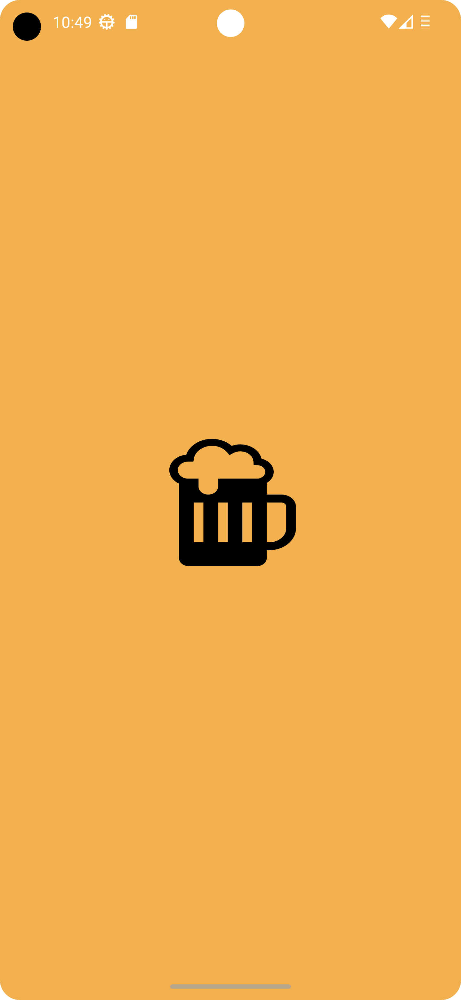
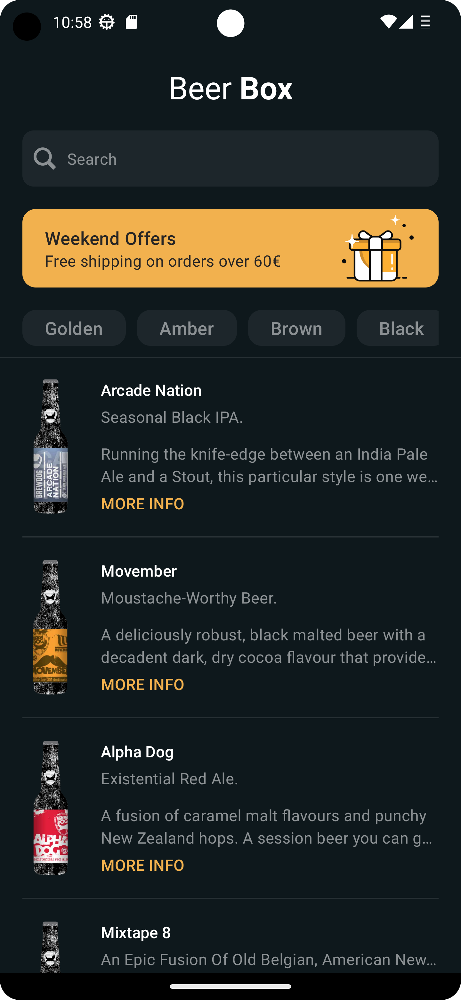
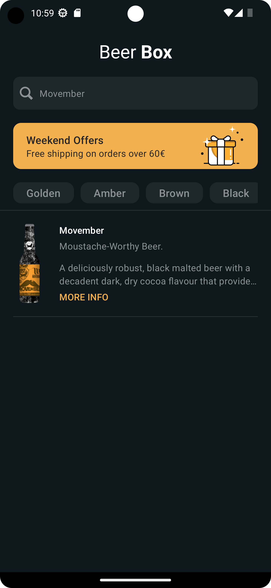
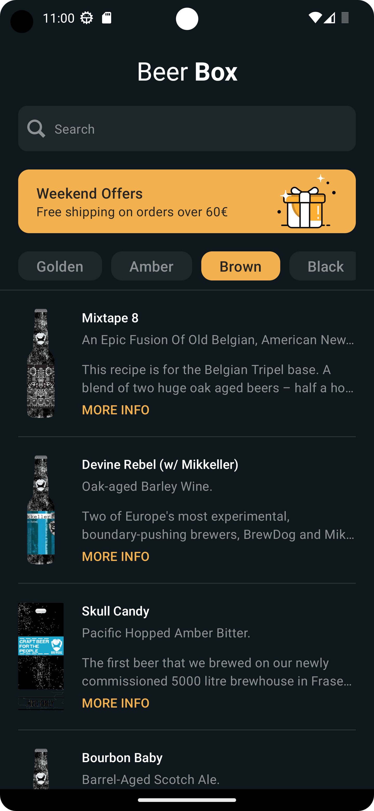
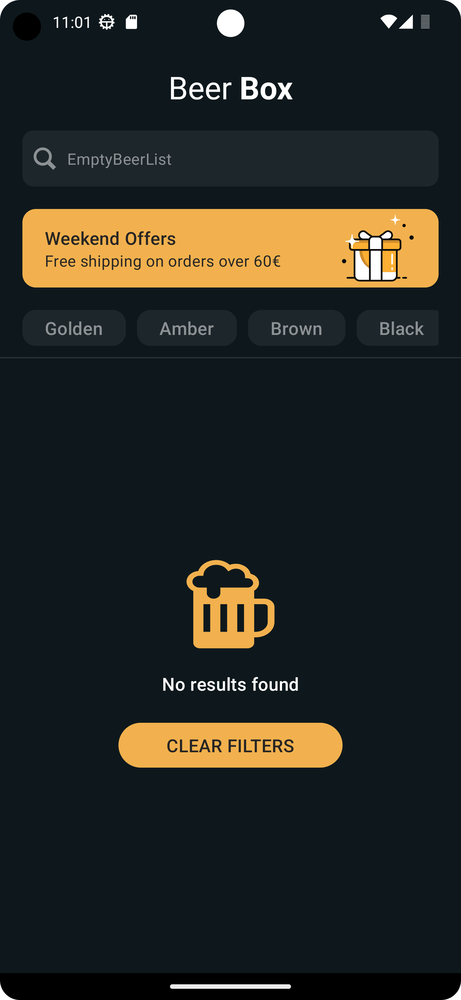
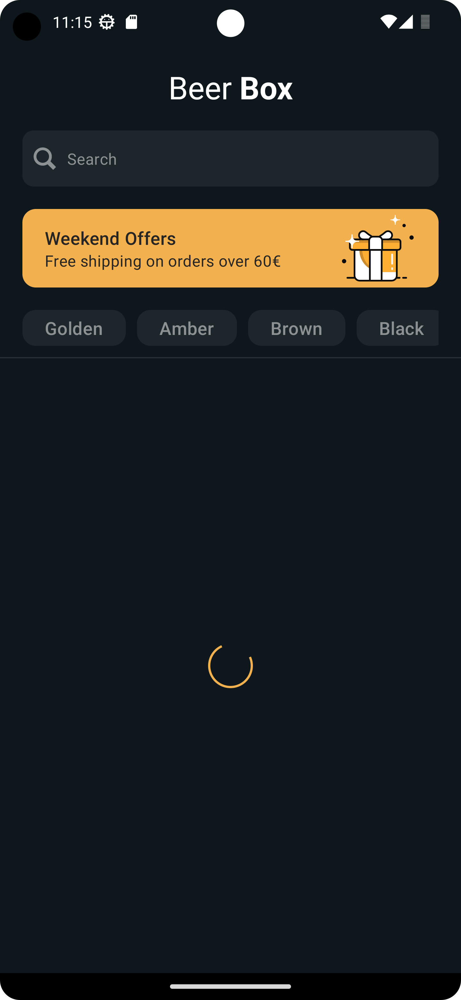
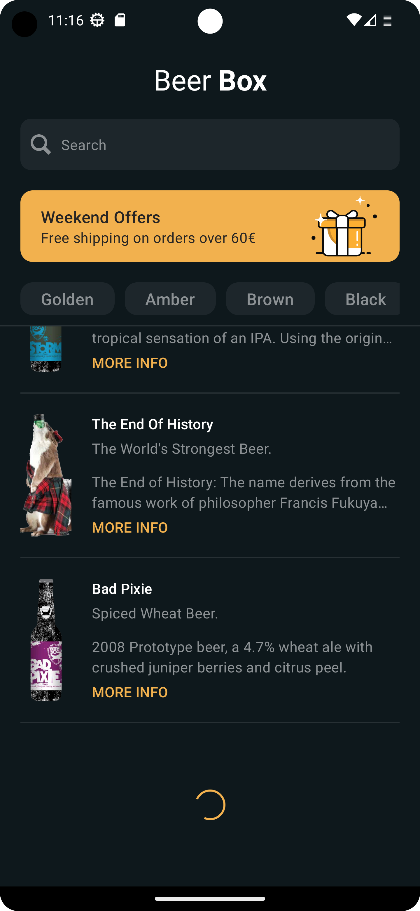
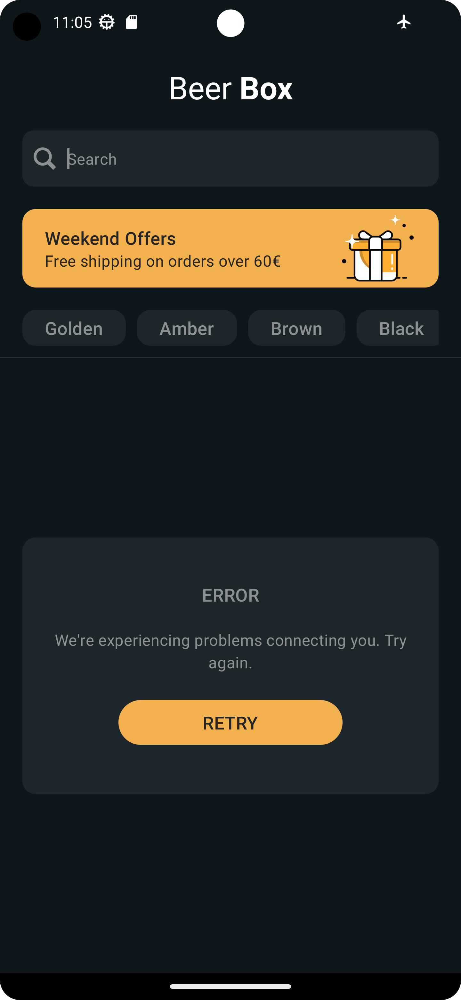
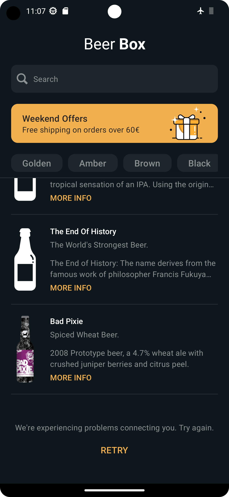

# BeerBox

BeerBox is a beer catalog sample Android application, where you can search and view all of Brewdog's
beers.

### ⬇️ Try out the app, download the apk from the link below:

[]()

# Table of Contents

1. [Architecture](#architecture)
2. [Libraries](#libraries)
3. [Features](#features)
4. [Credits](#credits)

## ARCHITECTURE : <a name="architecture"></a>

This project is based on the CleanArchitecture

 ```
com.giacomoparisi.beerbox
├── 📂 app/                          # App module that contains Application, Activity and 
|   ├── AppModule.kt                   main Dagger Module
|   ├── MainActivity.kt
│   └── App.kt
│
├── 📂 buildSrc/                     # Dependency versions, and projects settings organization
│
├── 📂 core/                         # Contains all possible shared UI and utilities for all 
|                                      presentation modules
│                       
├── 📂 data/                         # Module that interacts with external services like 
│                                      network or database
│                                     
├── 📂 domain/                       # Contains the business logic, also it is responsible 
|                                      for processing the data from the data layer to the 
|                                      presentation layer and viceversa
│                           
├── 📂 entities/                     # Contains all the data classes used by the business logic 
│   
└── 📂 home/                         # Presentation(UI) module for the home screen

```

## LIBRARIES <a name="libraries"></a>

- **Jetpack Compose**
  ```
  Official new Android’s recommended modern toolkit for building native UI.
  Benefits:
   - Simplifies and accelerates UI development on Android
   - Less code
   - Powerful preview and debug tools
   - No more xml files, only Kotlin for the entire project
   - Better and easier UI testing
  ```

- **View Model**
  ```
  Official Android library for ViewModel, a class for business logic or
  screen level state holder
  
  Benefits:
      - Better integration with the android framework
      - Caches state and persists it through configuration changes
        (no need to fetch data again when navigating between screens)
  ```
- **Kotlin Coroutines**
  ```
  Official Kotlin Coroutines libraries
  ```
- **Retrofit**
  ```
  HTTP client for Android
  Benefits:
     - Easier networking implementation for Android apps
     - Very fast
     - Reduce error-prone boilerplate code
     - Support for Kotlin Coroutines
     - Use OkHttp for low level network operations
  ```

- **Moshi**
  ```
  Moshi Json library for response deserialization
  ```

- **Dagger Hilt**
  ```
  Dependency injection library
  
  Benefits:
      - Reduce error-prone boilerplate code
      - Builds and validates dependency graphs, ensuring that every object's dependencies
        can be satisfied and no dependency cycles exist
      - Better dependencies management (dependencies scope, modules, singleton ecc.)
      - Easier unit and integration testing
  ```
- **Splash Screen**
  ```
        Official android library for brings the Android 12 splash screen
        to all devices from API 23
  ```

## FEATURES <a name="features"></a>

### SCREENS

<table class="tg">
<thead>
  <tr>
    <th class="tg-0pky">SPLASH</th>
    <th class="tg-0pky">HOME</th>
  </tr>
</thead>
<tbody>
  <tr>
    <th class="tg-0pky"></th>
    <th class="tg-0pky"></th>
  </tr>
</tbody>
</table>

### SEARCH

<table class="tg">
<thead>
  <tr>
    <th class="tg-0pky">TEXT SEARCH</th>
    <th class="tg-0pky">FILTERS SEARCH</th>
  </tr>
</thead>
<tbody>
  <tr>
    <th class="tg-0pky"></th>
    <th class="tg-0pky"></th>
  </tr>
</tbody>
 <thead>
  <tr>
    <th class="tg-0pky">EMPTY SEARCH</th>
    <th class="tg-0pky"></th>
  </tr>
</thead>
<thead>
 <tr>
    <th class="tg-0pky"></th>
    <th class="tg-0pky"></th>
 </tr>
</thead>
</table>

### LOADING

<table class="tg">
<thead>
  <tr>
    <th class="tg-0pky">MAIN LOADING</th>
    <th class="tg-0pky">NEXT PAGE LOADING</th>
  </tr>
</thead>
<tbody>
  <tr>
    <th class="tg-0pky"></th>
    <th class="tg-0pky"></th>
  </tr>
</tbody>
</table>

### ERROR

<table class="tg">
<thead>
  <tr>
    <th class="tg-0pky">MAIN ERROR</th>
    <th class="tg-0pky">NEXT PAGE ERROR</th>
  </tr>
</thead>
<tbody>
  <tr>
    <th class="tg-0pky"></th>
    <th class="tg-0pky"></th>
  </tr>
</tbody>
</table>

## Credits <a name="credits"></a>

The API used by this project are provided by **[Punk Api](https://punkapi.com/)**

## License

```
 Copyright 2023 Giacomo Parisi

   Licensed under the Apache License, Version 2.0 (the "License");
   you may not use this file except in compliance with the License.
   You may obtain a copy of the License at

       http://www.apache.org/licenses/LICENSE-2.0

   Unless required by applicable law or agreed to in writing, software
   distributed under the License is distributed on an "AS IS" BASIS,
   WITHOUT WARRANTIES OR CONDITIONS OF ANY KIND, either express or implied.
   See the License for the specific language governing permissions and
   limitations under the License.
```
